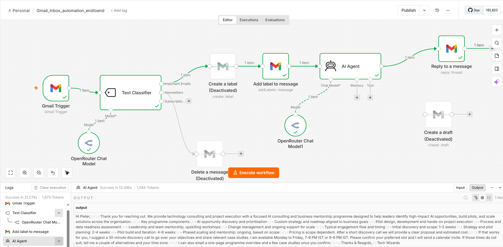
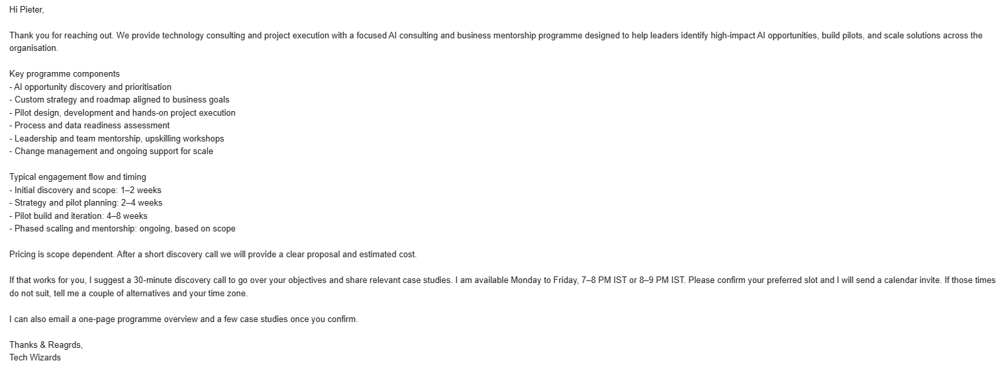
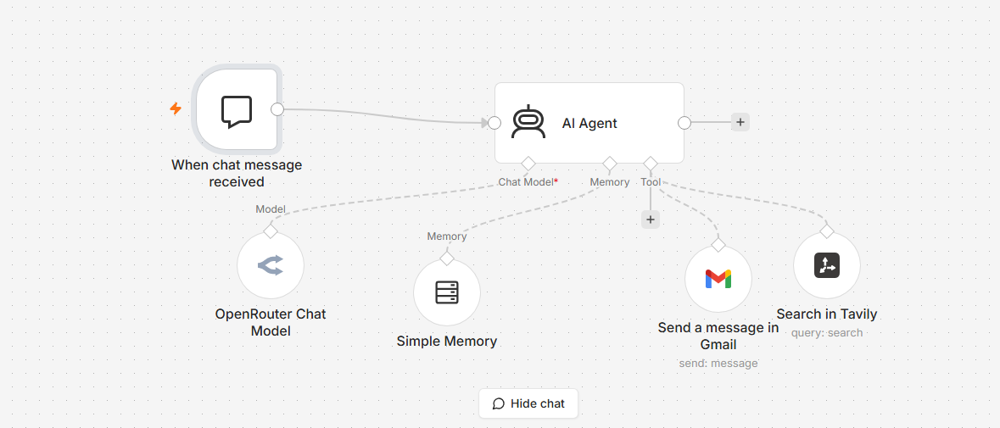
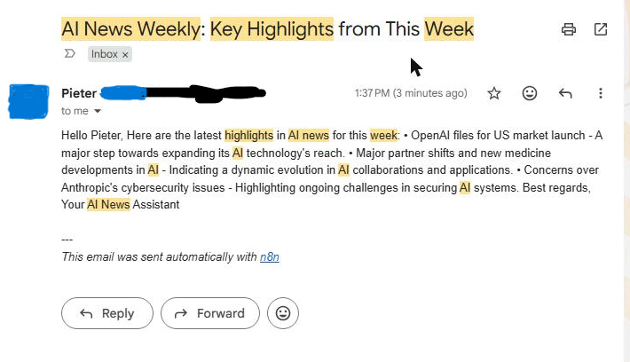
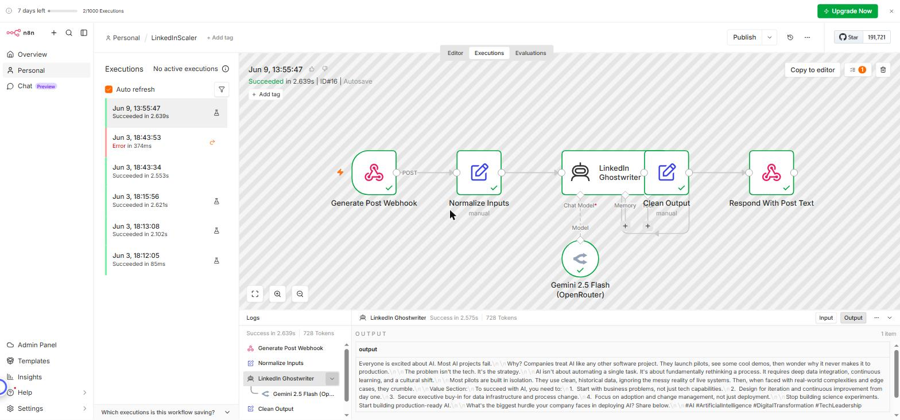
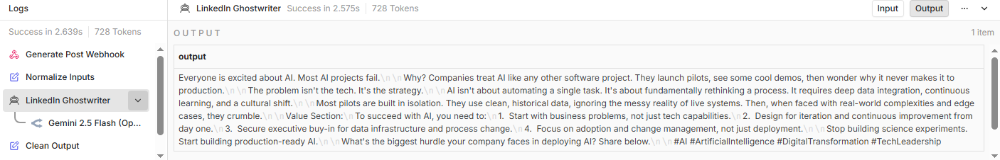
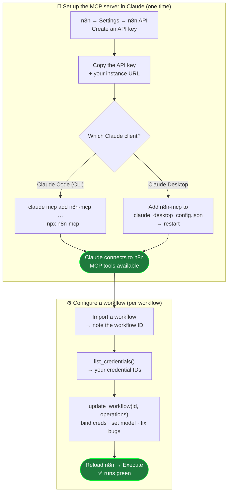

# n8n-mcp-workflow-setup

**Upload a workflow to n8n and let an MCP server configure and repair it for you — credentials, models,
and the bugs that stop it running — with zero clicks in the editor.**

When you upload a workflow into n8n, it can have inherent flaws or even bugs: credentials that don't match
your instance, an unselected model, hard-coded IDs that point nowhere, a node that errors the moment it
runs. You have two choices:

1. **Fix each non-functioning step by hand** — open every node, pick your credential, select a model,
   hunt down the broken parameter, retest.
2. **Wire up an MCP server and let it do the heavy lifting** — express the whole configuration once, as a
   small batch of declarative operations, and apply them in a single call.

This repo is the second option: three **sample workflows** plus the matching
[n8n-MCP](https://github.com/czlonkowski/n8n-mcp) operation batches that configure and repair them —
reproducible, diffable, and version-controlled.

---

## It works — zero manual fixes

The screenshots below were produced **after** the MCP applied its operations. No node was opened, no
field was edited by hand in the n8n editor.

**The configured workflow, running green in n8n** (credentials bound, models selected, broken nodes
handled automatically):



**The output it produced** — a polished, fully-automated reply, start to finish:



---

## Why a fresh upload doesn't "just run"

An exported `*.json` workflow looks portable, but several things don't carry across instances:

1. **Credentials don't travel.** n8n never exports secrets, and the credential *IDs* baked into the export
   don't exist in your instance — so on import every node comes in unauthenticated.
2. **Hard-coded resource IDs break.** Gmail label IDs, Slack channel IDs, Notion DB IDs and the like are
   account-specific; an ID from another instance is meaningless in yours.
3. **Idempotency bugs surface on the *second* run.** e.g. a "create label" node returns
   `409 — Label name exists` once the label already exists.
4. **Some fields ship blank.** Model pickers in particular often export empty.

Expressed as MCP operations, the entire fix looks like this:

```jsonc
// update_workflow(workflowId, operations)
[
  { "type": "setNodeCredential", "nodeName": "Gmail Trigger",         "credentialKey": "gmailOAuth2",   "credentialId": "<YOUR_GMAIL_CRED_ID>",      "credentialName": "Gmail account" },
  { "type": "setNodeCredential", "nodeName": "OpenRouter Chat Model", "credentialKey": "openRouterApi", "credentialId": "<YOUR_OPENROUTER_CRED_ID>", "credentialName": "OpenRouter account" },
  { "type": "setNodeParameter",  "nodeName": "OpenRouter Chat Model", "path": "/model", "value": "openai/gpt-4.1-mini" },
  { "type": "setNodeDisabled",   "nodeName": "Create a label", "disabled": true },
  { "type": "setNodeParameter",  "nodeName": "Add label to message", "path": "/labelIds", "value": ["IMPORTANT"] }
]
```

---

## What's in here

```
workflows/    Three sample n8n workflows (credential-free templates)
operations/   The matching n8n-MCP update_workflow operation batches to configure each one
images/       Screenshots of a configured workflow running and its output
```

| Workflow | What it does |
|---|---|
| [`workflows/gmail-inbox-classifier.json`](workflows/gmail-inbox-classifier.json) | Polls Gmail → classifies each email (*Important / Newsletter / Subscription*) with an LLM → labels + AI-drafts a reply to important mail, routes newsletters to a cleanup branch. |
| [`workflows/personalized-newsletter.json`](workflows/personalized-newsletter.json) | Chat-triggered AI agent that researches a topic via Tavily web search and emails a curated newsletter through Gmail, with buffer memory. |
| [`workflows/linkedin-scaler.json`](workflows/linkedin-scaler.json) | Two independent webhook flows. **Generate** → an AI ghostwriter (Gemini 2.5 Flash via OpenRouter) turns a topic into a viral-style post and returns it as text. **Publish** → posts approved text to LinkedIn. The Generate flow runs with just an OpenRouter key; the Publish flow needs your own LinkedIn Developer app (`w_member_social` + `openid profile`), so its author URN + credential ship blank by design. |

### Each one, configured and running

**Personalized newsletter** — the agent researches the topic and the email lands in the inbox (recipient details redacted):

| Running in n8n | The email it sent |
|---|---|
|  |  |

**LinkedInScaler** — the Generate flow runs green and returns a ready-to-post draft (nothing is published without your own LinkedIn app):

| Generate flow running | The post it produced |
|---|---|
|  |  |

---

## Set up the n8n-MCP server in Claude

The operations in this repo are applied through the **[n8n-MCP](https://github.com/czlonkowski/n8n-mcp)**
server (`npx n8n-mcp`), which connects Claude to your n8n instance over the n8n API.



### 1. Get an n8n API key

In n8n: **Settings → n8n API → Create an API key**. Copy the key and note your instance URL
(e.g. `https://your-instance.app.n8n.cloud`, or `http://localhost:5678` for a local instance).

### 2a. Claude Code (CLI)

```bash
claude mcp add n8n-mcp \
  -e MCP_MODE=stdio \
  -e LOG_LEVEL=error \
  -e DISABLE_CONSOLE_OUTPUT=true \
  -e N8N_API_URL=https://your-n8n-instance.com \
  -e N8N_API_KEY=your-api-key \
  -- npx n8n-mcp
```

On **Windows PowerShell**, quote each `-e` flag:

```powershell
claude mcp add n8n-mcp `
  '-e MCP_MODE=stdio' `
  '-e LOG_LEVEL=error' `
  '-e DISABLE_CONSOLE_OUTPUT=true' `
  '-e N8N_API_URL=https://your-n8n-instance.com' `
  '-e N8N_API_KEY=your-api-key' `
  -- npx n8n-mcp
```

### 2b. Claude Desktop (or any client using a config file)

Open the MCP config (Claude Desktop: **Settings → Developer → Edit Config**, which opens
`claude_desktop_config.json`) and add the server, then restart the app:

```json
{
  "mcpServers": {
    "n8n-mcp": {
      "command": "npx",
      "args": ["n8n-mcp"],
      "env": {
        "MCP_MODE": "stdio",
        "LOG_LEVEL": "error",
        "DISABLE_CONSOLE_OUTPUT": "true",
        "N8N_API_URL": "https://your-n8n-instance.com",
        "N8N_API_KEY": "your-api-key"
      }
    }
  }
}
```

The same `mcpServers` block works in a project-level `.mcp.json` for Claude Code. Once connected, Claude
can call `list_credentials`, `get_workflow_details`, `update_workflow`, `get_execution`, and the rest.

> Keep your API key out of source control — it lives in the MCP config / environment, never in a
> committed file.

---

## Use it

### 1. Import a workflow

Through the n8n UI (*Workflows → Import from File*) or with the MCP `create_workflow_from_code`. Note the
resulting **workflow ID**.

### 2. Find your credential IDs

```
list_credentials()
```

### 3. Apply the setup operations

Open the matching file in [`operations/`](operations/), replace the `<YOUR_*_ID>` placeholders with your
own IDs, and pass the array to:

```
update_workflow(workflowId = "<YOUR_WORKFLOW_ID>", operations = [ ... ])
```

`update_workflow` is **atomic** — if any operation fails (bad node name, missing credential), the whole
batch is rejected and nothing changes. Re-check node names with `get_workflow_details` and retry.

### 4. Reload and run

⚠️ n8n does **not** live-refresh an editor tab that was already open before an API edit — reload the
workflow page, then *Execute*.

---

## The operation cheat-sheet

| Need | Operation |
|---|---|
| Attach a credential to a node | `setNodeCredential` (`nodeName`, `credentialKey`, `credentialId`, `credentialName`) |
| Set a parameter inside `parameters` | `setNodeParameter` (`nodeName`, `path` e.g. `/model`, `value`) |
| Skip a node without rewiring | `setNodeDisabled` — **a disabled node passes data straight through** |
| Re-route a branch | `removeConnection` + `addConnection` |
| Rename / move | `renameNode` / `setNodePosition` |

### Debugging a failed run

`get_execution(executionId, includeData: true)` returns the failing node, the branch that was taken, and
the raw provider error body — so you confirm, e.g., a `409 Label name exists or conflicts` instead of
guessing.

---

## Worked example: the Gmail classifier

A freshly-imported copy of this workflow hits three issues; here's the complete fix as one reproducible
flow — see [`operations/gmail-inbox-classifier.ops.json`](operations/gmail-inbox-classifier.ops.json):

1. **Bind credentials** on all Gmail + OpenRouter nodes.
2. **`409 Label name exists`** → disable the `Create a label` node (it's pass-through, so the chain holds).
3. **Invalid label IDs** → set `Add label to message` to the valid `["IMPORTANT"]` system label.
4. *(Optional reply mode)* swap `AI Agent → Reply to a message` for `AI Agent → Create a draft` to review
   replies as unsent drafts instead of auto-sending.

The screenshots at the top of this README are the result: the workflow runs end-to-end and produces the
reply, with everything configured by the MCP.

---

## License

[MIT](LICENSE). The sample workflow templates are provided as-is for educational use. The n8n-MCP project
is © its respective authors.
